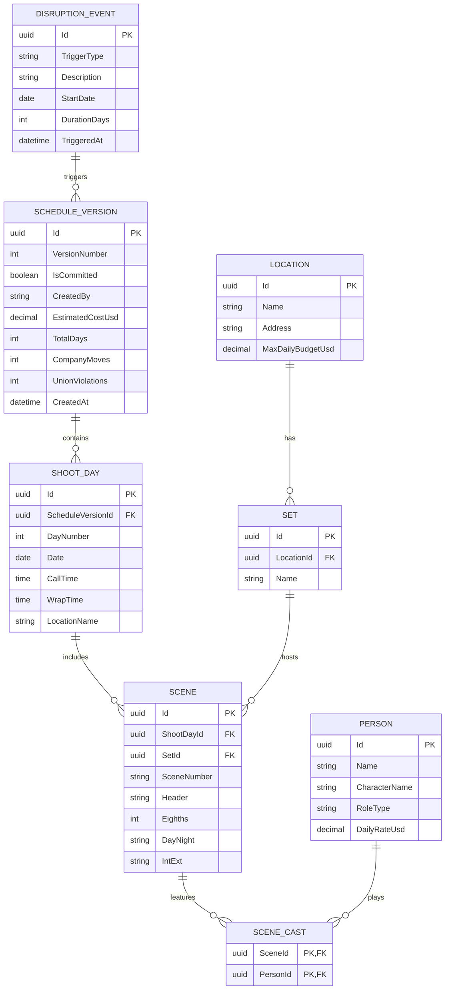

# 🗄️ Entity-Relationship Diagram — Data Domain Model

> **Scope**: PostgreSQL 16 Entity Data Model (`Stripboard.Domain` & `Stripboard.Infrastructure`)  
> **Format**: Mermaid Entity-Relationship Diagram  
> **Language**: English

---

## 1. Domain Entity Relationship Diagram

