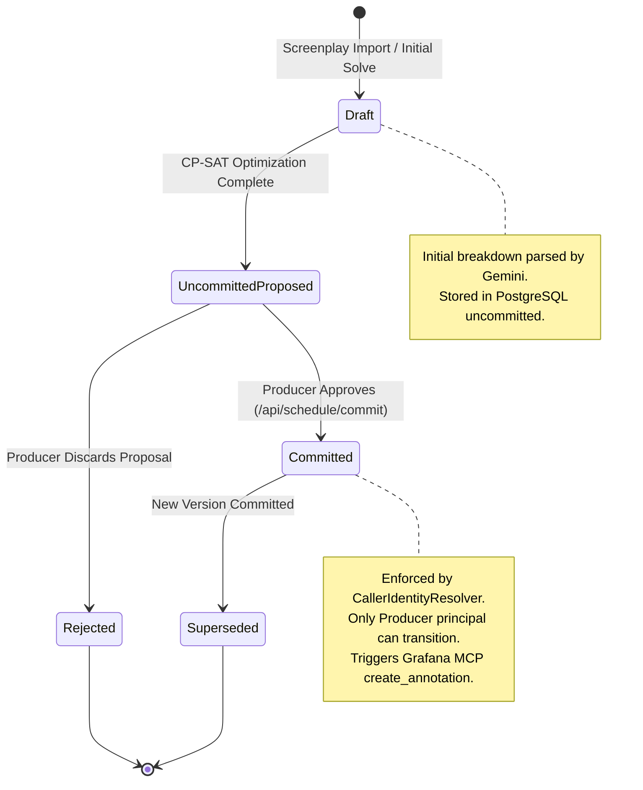
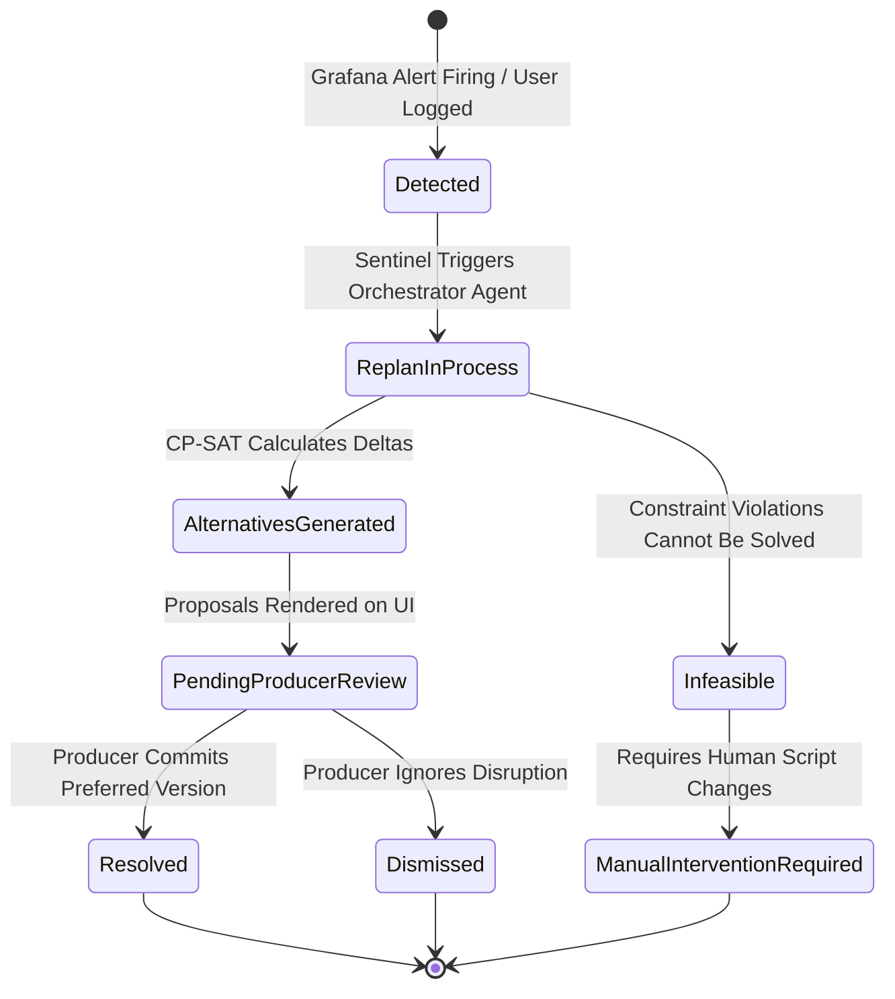

# 🔀 State Diagrams — Schedule Version & Disruption Lifecycle

> **Scope**: Lifecycle of Schedule Versions and Disruption Events in Stripboard  
> **Format**: Mermaid State Diagrams  
> **Language**: English

---

## 1. Schedule Version Lifecycle State Diagram

---

## 2. Disruption Event Lifecycle State Diagram

