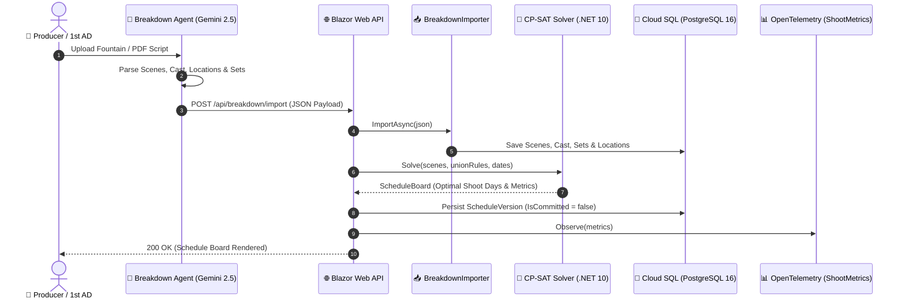
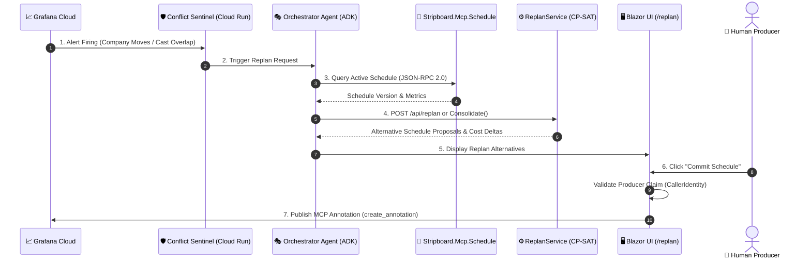
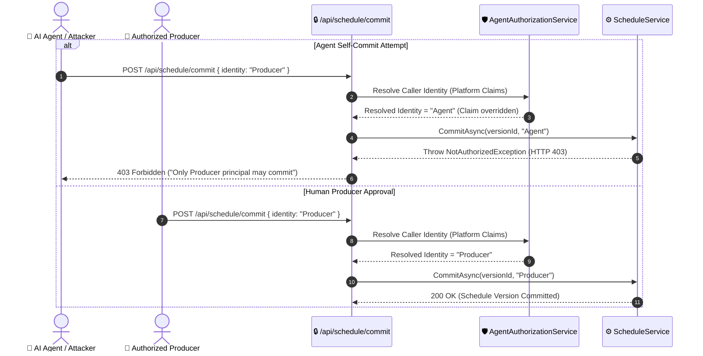

# 🔄 Sequence Diagrams — Stripboard System Flows

> **Scope**: System Interaction Sequences (Fountain Script Import, Alert-Triggered Replan Loop, Producer Authorization)  
> **Format**: Mermaid Sequence Diagrams  
> **Language**: English

---

## 1. Screenplay Breakdown & Schedule Solving Sequence

---

## 2. Grafana Cloud Alert & Autonomous Replan Loop Sequence

---

## 3. Producer Authorization vs Agent Self-Commit Rejection Sequence

