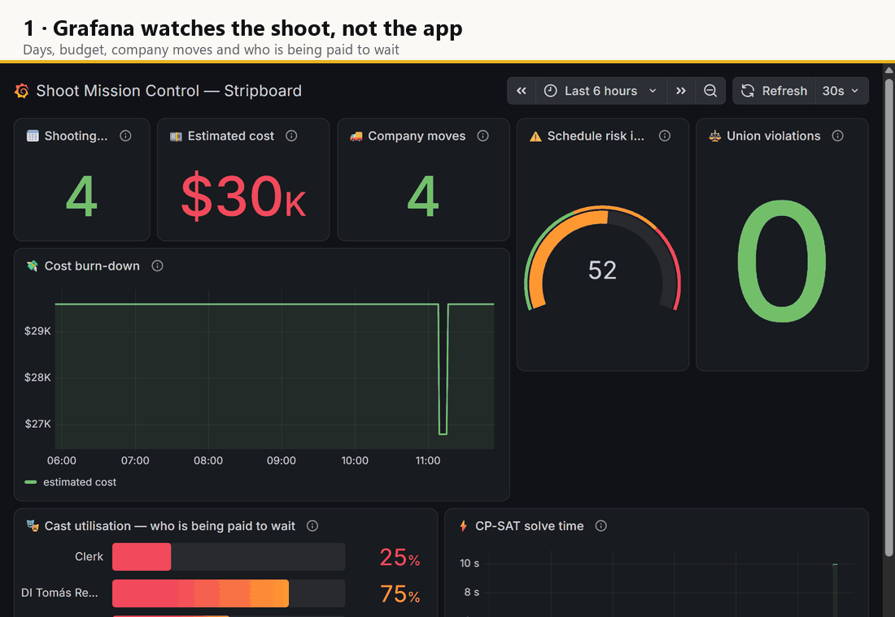
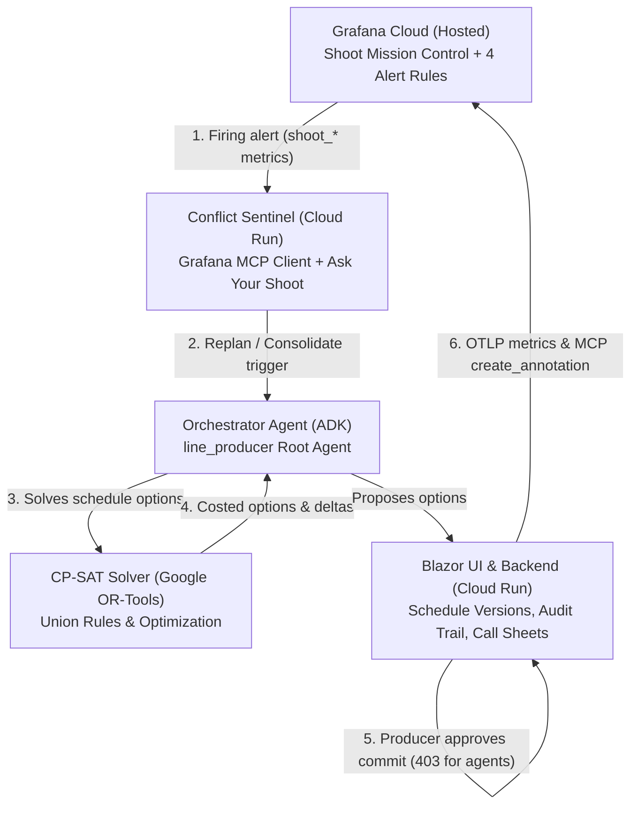
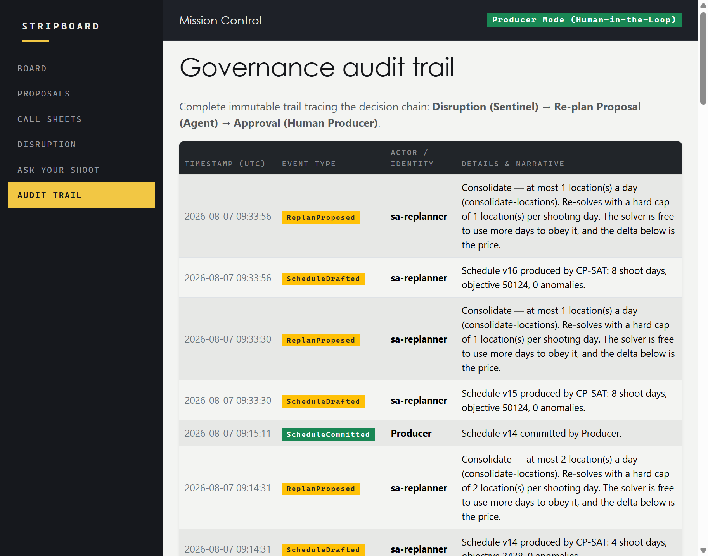
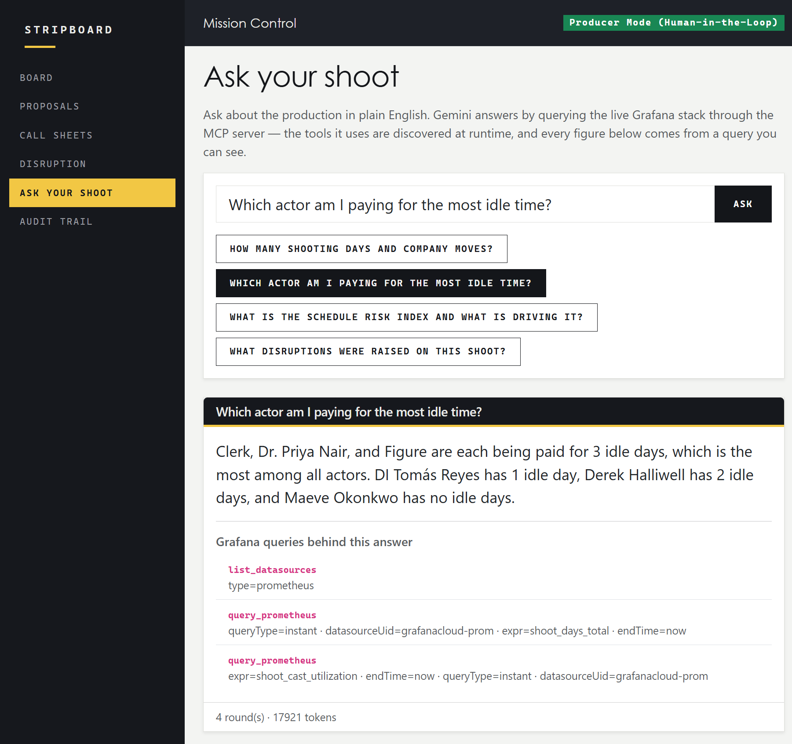
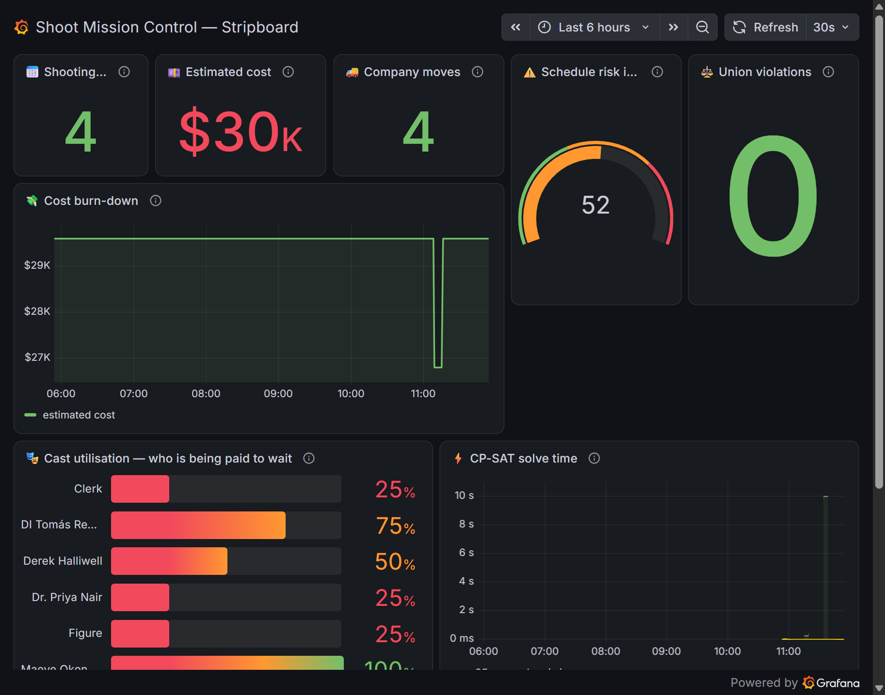
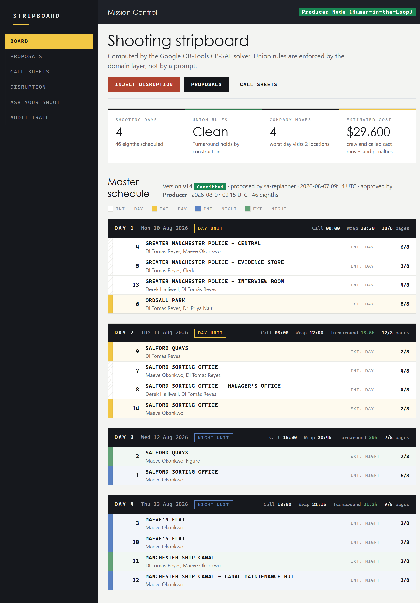
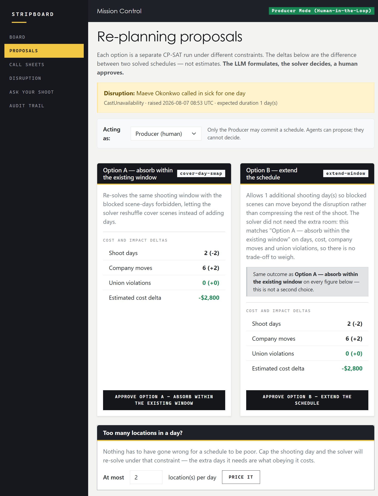

# 🎬 Stripboard — Autonomous Line Producer for Film Shoots

> **The LLM formulates, the solver decides, a human approves.**



*Four real screens of the deployed demo, captioned — a composed sequence, not a screen
recording.*

Stripboard is a multi-agent system that acts as an autonomous line producer for film
production: it breaks down a screenplay into typed scenes and elements, builds an optimal
shooting schedule, continuously watches for disruptions (cast availability, permits,
weather, union rules), and replans in seconds — with ranked options, cost deltas, and a
human producer approving every commit.

Built for the [Agentic Cinema Hackathon](https://agentic-cinema.devpost.com/)
(Google Cloud) — **Grafana partner track**.


[](https://youtu.be/6LZxawdvXaU)


[](https://pinkcorridor3522.grafana.net/public-dashboards/1e372a04e0974e1fa34afb2e143957c3)


## Where to look first

**Live demo: <https://stripboard-web-wc7oib7k6q-ew.a.run.app>** — deployed on Cloud Run and
verified end to end in a browser with zero console errors: inject a disruption, compare the
costed options, approve as Producer, read the audit trail. See
[ADR-011](adr/ADR-011-blazor-server-on-cloud-run.md) for what Blazor Server needs from Cloud
Run.

It scales to zero while the hackathon credits are pending, so the **first** request may take a
few seconds. Everything after that is warm. See *Stopping the paid services* below.

**Live Grafana dashboard, no account needed:
<https://pinkcorridor3522.grafana.net/public-dashboards/1e372a04e0974e1fa34afb2e143957c3>** —
"Shoot Mission Control", reading the same `shoot_*` metrics the Conflict Sentinel queries over
MCP. It is the shortest way to check that the partner integration is real rather than
described.

**The 3-minute video: <https://youtu.be/6LZxawdvXaU>** — seven shots, chaptered, with English
subtitles. It is the fastest way to see the loop close: a Grafana rule fires, the sentinel reads
it back over MCP, the solver prices two options, an agent is refused, a human approves.

## The problem

A shooting schedule is a brutal constraint-satisfaction problem: scenes must be grouped
by location to minimize company moves, cast availability (Day Out of Days) must be
honored, union rules enforced (12-hour turnaround, meal penalties, night-to-day
transitions), permit windows and daylight hours respected. It breaks constantly — an
actor gets sick, weather turns, a permit falls through — and the 1st Assistant Director
replans the whole thing by hand, often overnight, then redistributes call sheets to the
entire crew.

## Architecture

**Grafana is not a destination on the right-hand edge of this diagram; it is step 1 of the
loop.** Metrics about the *shoot* leave the application over OTLP, a rule in Grafana Cloud
fires on them, and the Conflict Sentinel reads that firing rule back over MCP and starts a
replan. Nobody is watching a screen when it happens.

> Every box carries **what it is** and **where it runs**. `[✓]` is true today; `[ ]` is
> written and not shipped. **There are none left**: every box below is running. What the
> status section above still lists as gaps is work outside this diagram.

```
   ┌──────────────────────────────────────────────────────────────────────┐
   │ GRAFANA CLOUD                                            hosted [✓]  │
   │ "Shoot Mission Control" · 4 alert rules over shoot_* metrics         │
   │ grafana/mcp-grafana, run as a sidecar we control — 73 tools          │
   └──▲─────────────────────────────────────────────────────────────┬─────┘
      │ 6  OTLP: metrics about the SHOOT & MCP create_annotation    │ 1  a rule
      │    (timeline decision written back)                         │    fires
      │                                                             ▼
   ┌──┴─────────────────────────┐            ┌──────────────────────┬─────┐
   │ Blazor UI              [✓] │            │ Conflict Sentinel      [✓] │
   │ Cloud Run + Cloud SQL      │            │ private Cloud Run          │
   │ versions, audit trail      │            │ + "Ask your shoot"         │
   └──▲─────────────────────────┘            └────────────┬───────────────┘
      │ 5  a human Producer approves;                     │ 2  replan or
      │    every other identity: 403                      │    consolidate
      │                                                   ▼
   ┌──┴───────────────────────────────────────────────────┬───────────────┐
   │ 3  Orchestrator — ADK root agent with no tools of its own            │
   │    scheduler · replanner · governance    as sa-orchestrator   [✓]    │
   │                                          Vertex AI Agent Engine [✓]  │
   └──────────────────────────────┬───────────────────────────────────────┘
                                  │ 4  tools/call over MCP. No agent does arithmetic:
                                  ▼    every figure comes from a solver run
   ┌──────────────────────────────┬───────────────────────────────────────┐
   │ CP-SAT solver (Google OR-Tools) · union rules by construction  [✓]   │
   └──────────────────────────────┬───────────────────────────────────────┘
                                  │ people · locations · weather
   ┌──────────────────────────────┬───────────────────────────────────────┐
   │ mcp-schedule · mcp-people · mcp-locations · mcp-weather              │
   │ speak MCP [✓] · consumed by the agents [✓] · private on Cloud Run [✓]│
   └──────────────────────────────────────────────────────────────────────┘

   Feeding the loop, outside it:
   Breakdown — Gemini 2.5 Flash → typed scenes  [✓]
   Call sheets — QuestPDF, role-scoped          [✓]
```



The governance step is drawn as an arrow rather than a note because it is one: an agent may
call `/api/schedule/commit` and the service answers **403** for every identity but a human
Producer. Commit approval triggers `create_annotation` over MCP to write the decision back to
Grafana Cloud, closing the loop.

Design principles the implementation is being held to:

- **The LLM must never "reason" schedules.** Gemini's role is to extract, formulate and
  explain; a deterministic CP-SAT solver computes; union rules live in the domain layer as
  tested code, not in prompts. The solver and the domain rules already work this way.
- **Nothing commits without a human, and the board says who.** The replanner proposes ranked
  options with cost deltas; only the Producer role can commit a schedule version. *Proposed by*
  and *approved by* are two separate fields and two different people — the proposer is usually
  an agent, the approver can only ever be a human. They used to be one field, so the board read
  `Committed · created by sa-replanner`: a service account presented as the approver of the rule
  that exists to keep service accounts out. A reader believes the screen over the README.
- **Append-only versioning.** Every replan is a new `ScheduleVersion` with its parent,
  author (human or agent) and triggering disruption — the audit trail is free.

  
- **Least-privilege agents, in two rings.** Inside: the commit rule is enforced in
  `ScheduleService.CommitAsync` against an identity the *platform* proved rather than one the
  caller typed (EV-33). Outside: one service account per agent and per MCP server — twelve in
  all — of which **five hold no project role whatsoever**: `sa-breakdown`, `sa-scheduler`,
  `sa-replanner`, `sa-callsheets` and `sa-mcp-weather`. `cloudsql.client` is held by exactly
  four: the web app and the three MCP servers that read the schedule. `sa-sentinel` is not
  one of them and cannot reach the database. Every deployed service runs as its own identity.
  See [`docs/EVIDENCE.md`](docs/EVIDENCE.md) §8 for the policy dump.

## Technology

| Piece | Technology | Status |
|---|---|---|
| Solver | Google OR-Tools CP-SAT (.NET bindings) | ✅ working |
| Domain & union rules | C# / .NET 10, pure domain layer | ✅ working |
| Call sheets | QuestPDF | ✅ working |
| Web UI | Blazor Server (.NET 10) | ✅ driven by the solver |
| Services | Four MCP servers (`ModelContextProtocol.AspNetCore`) | ✅ speak MCP · ✅ deployed, private |
| Data | EF Core 9 → **Cloud SQL (PostgreSQL 16)**, migrations applied at startup | ✅ working |
| Grafana dashboard | Versioned JSON + provisioning script (`infra/grafana/`) | ✅ working |
| Grafana alert rules | Versioned JSON over `shoot_*` metrics, provisioned by script | ✅ working |
| Screenplay breakdown | Gemini 2.5 Flash on Vertex AI (`google-genai`, structured output) | ✅ working |
| Replanner agent | Google ADK `LlmAgent` over the solver API | ✅ working |
| Orchestration | Google ADK root agent + sub-agent transfer | ✅ working |
| Agent hosting | Vertex AI Agent Engine | ✅ deployed, running as `sa-orchestrator` |
| Agent-to-agent | A2A wire protocol | ❌ not implemented, and deliberately not planned — see the gap table above |
| **Partner integration** | Grafana MCP client — Streamable HTTP, JSON-RPC 2.0, 73 tools | ✅ working |
| MCP servers of our own | `ModelContextProtocol.AspNetCore` 2.1.0, 33 contract tests | ✅ built · ✅ consumed by the agents · ✅ private on Cloud Run |
| Observability (partner) | OpenTelemetry OTLP → Grafana Cloud, `shoot_*` production metrics | ✅ working |
| Governance | Commit requires a platform-proved Producer, not a name in the payload | ✅ working |
| Mutation testing | Stryker.NET over `UnionRulesService` — 100%, 0 survivors | ✅ working |
| Security | Secret Manager for every credential; one service account per agent, four holding no role at all | ✅ working · 🚧 agents not yet running as them |

### Grafana partner track

The track requires the Grafana stack to be used at runtime through the official
`grafana/mcp-grafana` MCP server. Why this track and what counts as qualifying use are
recorded in [ADR-005](adr/ADR-005-grafana-track.md) and
[ADR-008](adr/ADR-008-grafana-mcp-qualifying-use.md). Stripboard does this for real:

- **`agents/sentinel/grafana_mcp_client.py`** implements the MCP **Streamable HTTP**
  transport directly over JSON-RPC 2.0 — `initialize` with session negotiation,
  `notifications/initialized`, paginated `tools/list`, and `tools/call` — accepting both
  JSON and SSE responses. No client library; the only dependency is `requests`.
- **73 tools are discovered** at runtime against Grafana Cloud. Five of them are actually
  called: `create_annotation` and `get_annotations` (disruptions), `alerting_manage_rules`
  (firing rules), `query_prometheus` and `list_prometheus_metric_names` ("Ask your shoot").
  The rest are offered to Gemini, not exercised by us.
- **Disruptions are published as Grafana annotations through the MCP server**, not through
  the REST API, and are read back attributed to the sentinel's service account.
- **Alerts are read back over MCP**: the four rules below are queried with
  `alerting_manage_rules`, and a firing one starts a replan with no human involved until the
  approval step.
- **Gemini reasons over the MCP toolset**: "Ask your shoot" discovers the tools at runtime,
  and the first turn is forced to call one, so an answer cannot be a number the model made up.
- The server runs as a **sidecar we control** (`infra/grafana/run-mcp-sidecar.sh`). The
  hosted Grafana Cloud MCP endpoint authorises via interactive OAuth 2.1, which an
  unattended agent cannot complete — see [ADR-010](adr/ADR-010-grafana-mcp-sidecar-transport.md).

#### What is on the wire

Eleven instruments, exported over OTLP from `src/Stripboard.Infrastructure/Telemetry/ShootMetrics.cs`.
Nine describe the shoot; two describe the solver. **A gauge with no committed schedule to
describe publishes nothing at all** — not `0` — because a rule watching for union violations
reads zero as a clean shoot ([ADR-014](adr/ADR-014-observing-the-shoot.md)).

| Metric | What it means to a 1st AD |
|---|---|
| `shoot_days_total` | Shooting days in the committed schedule |
| `shoot_company_moves` | Moves *within* a day; overnight relocations are not charged, because the solver does not charge for them either |
| `shoot_cost_estimate_usd` | Crew and called cast per day, plus move and penalty costs |
| `shoot_union_violations` | Rules broken by the committed schedule — legal exposure, not preference |
| `shoot_locations_per_day_max` | The **worst** day's location count. A maximum, not an average: one good day does not make up for a day spent in the van |
| `shoot_cast_utilization{actor}` | Fraction of shooting days each actor is called for — a contract paid against days not worked |
| `shoot_risk_index` | 0–100 heuristic of schedule fragility. Deliberately **not** alerted on (see below) |
| `shoot_scenes_total`, `shoot_eighths_total` | Size of what is scheduled |
| `solver_solve_duration`, `solver_solves_total` | The CP-SAT run itself |

#### The four alert rules

Versioned in `infra/grafana/alert-rules.json` and provisioned by script. Thresholds are
calibrated against schedules this solver actually produces, not guessed.

| Rule | Expression | For | Severity | `stripboardAction` |
|---|---|---|---|---|
| Unit hopping between locations in a day | `shoot_locations_per_day_max > 2` | 5m | high | `consolidate` |
| Union violation in the committed schedule | `shoot_union_violations > 0` | 1m | critical | `replan` |
| Cast paid to wait | `min(shoot_cast_utilization) < 0.34` | 10m | medium | `replan` |
| Schedule cost above budget | `shoot_cost_estimate_usd > 45000` | 5m | high | `replan` |

Every rule carries two labels, and the distinction between them is the design point:
`stripboardTrigger` says **what happened**, `stripboardAction` says **what to do about it**.
They are not the same question. A day that visits four locations blocks no scene and cancels
no permit, so there is nothing for the replanner to absorb — the answer is to price a
constraint, not to route around a disruption. A rule with no `stripboardTrigger` is one
nobody can act on, and the provisioner refuses to create it. See
[ADR-019](adr/ADR-019-alerting-on-the-shoot.md).

`shoot_risk_index` has no rule, and that is a finding rather than an omission. The first draft
set it at 60 and no real schedule came close — the 14-scene demo scores 44 *while* running a
day that visits four locations. Lowering the threshold until it fired would have taught us
nothing, because "risk is 46" is not an instruction. A dashboard tolerates a composite; an
alert needs an action.

**Gemini answers from the live stack, and shows its working.** "Ask your shoot" discovers the
MCP server's tools at runtime and prints the queries beneath every answer, so a figure on the
page can be traced to the `query_prometheus` call that produced it:



#### Seeing it without an account

The **"Shoot Mission Control"** dashboard is versioned JSON provisioned by script, and it is
published read-only:

**<https://pinkcorridor3522.grafana.net/public-dashboards/1e372a04e0974e1fa34afb2e143957c3>**



Nine panels over the metrics above. Give them a few seconds — a cold public dashboard renders
its panel frames before its data, and an impatient screenshot shows an empty board. It reads from the same Grafana Cloud stack the Conflict
Sentinel queries over MCP — no login, no separate data. If a panel says *No data*, the web
service has scaled to zero and nothing is exporting; see *Stopping the paid services*.

The distinguishing choice is what is being observed. Almost anything in this track can point
Grafana at its own request latency; here the *shoot* is the observed system — cost burning
down, actors paid against days they do not work, a schedule risk index — and Grafana is what
notices when it goes wrong.

#### The second dashboard: observing the agent

The track asks for two things — *build an agent that uses observability data*, and *observe the
agent you build*. The paragraph above is the first. The second is a separate dashboard,
**"The Agents Themselves"**, published read-only alongside the first:

**<https://pinkcorridor3522.grafana.net/public-dashboards/c046a2db657a4d42bf4e243afc825bc9>**

It reads four metrics the agents emit about their own behaviour
(`infra/grafana/dashboard-agent-observability.json`):

| Metric | The question it answers |
|---|---|
| `agent_llm_tokens_total` | What a question costs. *Ask your shoot* runs several Gemini rounds with MCP calls between them, and a question that quietly takes six rounds costs six times one that takes one. |
| `agent_llm_duration_milliseconds` | Where the twenty seconds go — model time, split from tool time below, because *the model is slow* and *Grafana is slow* need different fixes. |
| `agent_mcp_calls_total` | Every `tools/call`, by server, tool and outcome. The partner integration counted from the inside: not "we use MCP" but which tools, how often, and **how many fail** — the failure path is counted too, because a counter that only increments on success reports a healthy integration right up until nothing works. |
| `agent_mcp_duration_milliseconds` | How long the far end takes, by server. Grafana Cloud and our own Cloud Run services answer at very different speeds. |

Those series names are not a guess. They were read back from the stack with
`list_prometheus_metric_names` after a real export, because a panel querying a name that does
not exist and a panel with nothing to draw look identical.

**Two dashboards rather than one, on purpose.** The distinguishing claim of this project is
that the *shoot* is the observed system, and that claim survives only while "what is being
observed here?" has one answer per screen. Put `agent_llm_tokens_total` beside
`shoot_cast_utilization` and a judge has to work out which one the project is about. Separate
boards keep both questions askable: Mission Control is the production, this one is the software
that reschedules it.

Instrumentation lives in `agents/common/telemetry.py` and is **inert without
`OTEL_EXPORTER_OTLP_ENDPOINT`** — the agents run on laptops as often as in Cloud Run, and an
SDK that fails loudly because nobody set an endpoint makes a working demo look broken. The
deployed sentinel gets the endpoint and its push credentials from the same Secret Manager entry
the web service uses, so there is one place to configure and one to rotate.

    python infra/grafana/provision-dashboard.py     # provisions both, from versioned JSON

## Why not Movie Magic?

Because it is very good at the half of the problem this does not touch, and does not attempt
the half this does.

**Movie Magic Scheduling**, **StudioBinder**, **Yamdu** and **Scenechronize** are the tools
productions actually use, and they are better than this at nearly everything a 1st AD does in a
day: breakdown tagging, strip manipulation, Day Out of Days reports, call sheet distribution,
and the integrations a real production office needs. Nothing here is trying to replace them.

What they have in common is that **the arrangement is the human's**. They give a 1st AD an
excellent surface for building and rearranging a schedule; the judgement about which scenes go
on which day, and the overnight rebuild when an actor calls in sick, is theirs. And none of them
watches the shoot: a schedule is a document that goes stale between the moment it is printed and
the moment something changes.

Stripboard is the other half. The schedule is **computed** by a constraint solver under hard
union rules rather than arranged by hand, so the alternatives to a disruption arrive priced —
*two extra shooting days and $5,600 to remove two company moves* — instead of needing to be
worked out. And the shoot is **observed**: its own metrics go to Grafana, an alert rule on them
fires, and the replan starts without anyone noticing first. A human still approves every commit,
and cannot be talked out of that by an agent.

The honest summary: an incumbent is a better place to *keep* a schedule. This is an argument
about how the schedule gets *decided*, and about who finds out first when it stops being true.

## Scale

The demo screenplay is 14 scenes. A feature is 90 to 130, so the fair question is whether
CP-SAT still answers at that size — or whether it quietly returns the first thing it finds and
calls it a schedule. Measured, at four sizes cut from one generated feature (`demo/screenplay-longform.fountain`,
112 scenes, 25 locations, 14 speaking parts) so that size is the only variable:

| Scenes | Locations | Cast | 8ths | Days | Company moves | Cost | Optimality proved? | Elapsed |
|---:|---:|---:|---:|---:|---:|---:|:---:|---:|
| 14 | 12 | 7 | 101 | 4 | 9 | $50,100 | **yes** | 3.4s |
| 28 | 14 | 9 | 204 | 7 | 12 | $81,300 | no | 10.2s |
| 56 | 19 | 10 | 409 | 12 | 16 | $119,800 | no | 11.4s |
| 112 | 25 | 14 | 797 | 29 | 38 | $276,100 | no | 11.2s |

**It answers at feature length.** A 112-scene picture is scheduled in about eleven seconds,
end to end — import, solve and persist.

**Past roughly 30 scenes it stops proving optimality**, and that is stated rather than hidden.
Within the default cap the solver returns the best schedule it *found*, not the best that
exists. What it never returns is an illegal one: turnaround, Day Out of Days and permit windows
are **constraints of the model**, not goals of the search, so they hold whether or not the
search ran to completion. More time buys a cheaper plan, never a legal one.

**What more time is worth**, same benchmark with the cap raised to 60 seconds:

| Scenes | Days @10s | Days @60s | Cost @10s | Cost @60s |
|---:|---:|---:|---:|---:|
| 28 | 7 | 7 | $81,300 | $75,300 |
| 56 | 12 | 12 | $119,800 | $119,300 |
| 112 | **29** | **22** | **$276,100** | **$210,300** |

At feature length, fifty more seconds of search is worth seven shooting days and about
$66,000 — a quarter of the budget. The ten-second default is a **product** decision, not a
limit of the solver: a producer is waiting on a web request. It is configurable, so a
production planning the whole picture overnight is a different setting rather than a different
system:

```bash
STRIPBOARD_SOLVER_SECONDS=60 dotnet run --project src/Stripboard.Web
```

Reproduce the table:

```bash
dotnet run --project src/Stripboard.Web          # in another terminal
python demo/make_longform_screenplay.py
python demo/run_scale_benchmark.py               # refuses to run against a deployed instance
```

## What the money figures are anchored to

A cost model nobody can check is a number with a dollar sign in front of it. Every figure the
board shows comes from the day rates in the database and the rules in `CostModel`, and this is
where each one stands (EV-44):

| Figure | Anchor |
|---|---|
| Cast day rate | A SAG-AFTRA day player on the 2025–26 Basic Theatrical Agreement is **$1,246 in wages plus $261.66 pension and health, $1,507.66 all in**, before overtime or overscale. The demo seeds $1,500 for a lead |
| Low-budget productions | Run at **65%** of Basic, micro-budget at **35%** — which is why rates live in the database and a production substitutes its own |
| Meal penalty | Per performer and escalating: **$25** for the first half hour, **$35** for the second, **$50** thereafter |
| Turnaround violation | The expensive one — compensated at up to **a full day's pay** |
| Company move | **A stand-in.** There is no published rate. The shooting hour it eats is charged separately in the schedule; the $2,500 is the cash on top, an order of magnitude rather than a quotation |

**And one figure is honestly blended.** `UnionViolationPenaltyUsd` is a single $750 constant
covering both violations above, which in reality cost about $360 and about $1,246. One constant
cannot be both. It sits between them so a violation stays expensive enough to matter to the
objective without pretending to price a specific breach — and pricing them apart is the obvious
next refinement, needing the anomaly type to reach the cost model, which today it does not.

The `shoot_cost_estimate_usd > 45000` alert threshold follows from the demo's own shape rather
than from an industry figure: a four-day shoot of this crew and cast lands near $29,600, so
$45,000 is roughly half as much again — the point at which a schedule has drifted rather than
merely moved. A real production would set it from its budget line.

Sources: [SAG-AFTRA 2025 theatrical rates](https://www.topsheet.io/edu/rates/sag-aftra/sag-aftra-theatrical-rates-2025) ·
[Wrapbook, SAG rates guide](https://www.wrapbook.com/blog/essential-guide-sag-rates) ·
[SAG-AFTRA meal periods](https://www.sagaftra.org/meal-periods) ·
[Wrapbook, meal penalties](https://www.wrapbook.com/blog/meal-penalties-producers-guide)

## Repository layout

```
src/           .NET solution: Domain, Application, Infrastructure, Solver,
               four Mcp.* servers, CallSheets, Web (Blazor)
agents/        Python agent layer: breakdown, sentinel, replanner, orchestrator,
               common/ (the MCP transport all of them share)
tests/         xUnit: domain rules, solver, MCP protocol contracts, telemetry, call sheets
infra/         Cloud Run deploy scripts, Grafana dashboard + alert rules, per-agent IAM
adr/           Architecture Decision Records (ADR-005, ADR-008 … ADR-024)
demo/          Sample screenplays (Fountain, .fdx, PDF), demo harnesses, pitch deck
docs/          EVIDENCE.md — logs and figures behind the claims above,
               API_REFERENCE.md — the HTTP and MCP surface, img/ — screenshots
01_Diseno/     Mermaid entity, state and sequence diagrams
stryker-config.json  Mutation testing, scoped to the union rules
LICENSE·NOTICE Apache-2.0 and the attribution notice it asks for
```

## Quickstart

**Prerequisites.** The first block below needs only the first row; each later section says
what it adds.

| For | You need |
|---|---|
| Tests and the web UI | .NET 10 SDK |
| The agents | Python 3.12, and a GCP project with `aiplatform.googleapis.com` enabled |
| Grafana MCP | Docker, and a Grafana **service account** token (`glsa_` prefix) |
| Deploying | `gcloud`, authenticated against your own project |

> Verified locally on Windows with the .NET 10 SDK and Python 3.12. The cloud path is
> scripted and used daily — `infra/deploy-web.sh`, `infra/deploy-sentinel.sh`,
> `infra/grafana/provision-*.py` — with the exception of Agent Engine, which is written and
> deliberately unrun. **This has not been reproduced on a clean machine yet** (EV-31), so
> treat it as instructions rather than as a guarantee.

```bash
git clone https://github.com/hvaler/stripboard-dev.git && cd stripboard-dev

# Build and run the .NET test suite (105 tests)
dotnet test Stripboard.slnx

# Run the web UI at http://localhost:5164 — it seeds a screenplay and solves a
# schedule on first start, so the stripboard has real data immediately.
dotnet run --project src/Stripboard.Web

# Run the local demo harness (stubbed pipeline, no cloud dependencies)
python demo/run_demo.py
```

### Our own MCP servers

Four of them — schedule, people, locations, weather. They speak the protocol, so any MCP
client can discover their tools:

```bash
dotnet run --project src/Stripboard.Mcp.Schedule    # then also People, Locations, Weather

curl -s -X POST http://localhost:5067/mcp \
  -H 'Content-Type: application/json' -H 'Accept: application/json, text/event-stream' \
  -d '{"jsonrpc":"2.0","id":1,"method":"tools/list"}'
```

`mcp-schedule` seeds and solves an initial schedule at startup, so there is something real to
ask about the moment it is up.

`commit_schedule` is there on purpose and will refuse you. Running locally there is nothing
authenticating anyone, so every caller is unverified — and an unverified caller cannot
commit no matter what identity it sends
([ADR-020](adr/ADR-020-identity-is-not-a-string-the-caller-sends.md)).

**The agents consume this server.** Point the orchestrator at it and its `scheduler` and
`governance` specialists take their tools from `tools/list` rather than from Python:

```bash
export STRIPBOARD_MCP_SCHEDULE_ENDPOINT=http://localhost:5067/mcp
python demo/run_orchestrator.py
```

```
Engine reached over: MCP — tools/call against http://localhost:5067/mcp
Tools discovered:    commit_schedule, consolidate_schedule, create_schedule,
                     get_schedule, validate_rules

  handled by: scheduler
  tool:       scheduler  -> get_schedule({})
  handled by: governance
  tool:       governance -> commit_schedule({'identity': 'sa-stripboard-replanner', …})
              → refused by the server, not by a prompt
```

Unset the variable and the same demo runs against the web app's REST API instead
([ADR-023](adr/ADR-023-agents-consume-our-own-mcp-servers.md)).

**Against the deployed servers.** All four are on Cloud Run and none of them is public, so a
caller needs an identity token — which is also what makes the governance rule mean something
(see below):

```bash
bash infra/deploy-mcp.sh          # build, push, deploy all four, verify each is private

export STRIPBOARD_MCP_SCHEDULE_ENDPOINT=$(gcloud run services describe stripboard-mcp-schedule \
  --project stripboard-hack --region europe-west1 --format='value(status.url)')/mcp
export STRIPBOARD_MCP_BEARER_TOKEN=$(gcloud auth print-identity-token)
python demo/run_orchestrator.py
```

Deployment changes what the refusal can say, and the difference is the whole of EV-33:

```
locally     'Producer' claims the Producer role but nothing verified it.
on Cloud Run 'you@example.com' cannot commit a schedule. Only the Producer role may commit.
```

Locally nothing authenticates anyone, so *nobody* can commit whatever they claim. On Cloud
Run the identity is one Google validated, and the service refuses **a caller it can name**.

### Mutation testing the union rules

```bash
dotnet tool install --global dotnet-stryker
dotnet stryker          # scoped to UnionRulesService; breaks below 85%
```

Last run: **100%, 21 mutants killed, 0 survived**
([ADR-022](adr/ADR-022-mutation-testing-the-union-rules.md)).

### Screenplay breakdown with Gemini

Requires Google Cloud credentials. Vertex AI is the default backend:

```bash
pip install -r agents/breakdown/requirements.txt

gcloud auth application-default login
export GOOGLE_CLOUD_PROJECT=<your-gcp-project>   # needs aiplatform.googleapis.com enabled

# Real extraction — `-v` shows the Vertex AI call and the token count
python -m agents.breakdown --file demo/screenplay.fountain -v

# A full-length original screenplay: 14 scenes, 9 locations, day and night units
python -m agents.breakdown --file demo/screenplay-nightfall.fountain

# A screenplay unrelated to the demo script, to show it generalises
python -m agents.breakdown --file demo/screenplay-harbour.fountain

# Final Draft and PDF are read too — the PDF goes through Gemini multimodal
python -m agents.breakdown --file demo/screenplay-metropole.fdx
python -m agents.breakdown --file demo/screenplay-metropole.pdf

# Replay a cached breakdown without calling the model
python -m agents.breakdown --file demo/screenplay.fountain --offline
```

Feed a breakdown straight into the stripboard — the board re-solves and the screen changes:

```bash
python -m agents.breakdown --file demo/screenplay-harbour.fountain --json \
  | curl -s -X POST http://localhost:5164/api/breakdown/import \
         -H 'Content-Type: application/json' --data-binary @-
```

Alternatively set `GEMINI_API_KEY` to use the Gemini Developer API instead of Vertex AI.

Python tests (the breakdown integration tests make real Gemini calls, and skip when no
credentials are configured):

```bash
python -m unittest discover -s agents/breakdown    -p "test_*.py"   # 25
python -m unittest discover -s agents/sentinel     -p "test_*.py"   # 27
python -m unittest discover -s agents/replanner    -p "test_*.py"   # 12
python -m unittest discover -s agents/orchestrator -p "test_*.py"   # 19
```

### The agents

```bash
pip install -r agents/orchestrator/requirements.txt
export STRIPBOARD_URL=http://localhost:5164        # or the deployed Cloud Run URL

# Three requests, three specialists — and the commit refused for an agent identity
python demo/run_orchestrator.py
```

Deploying the orchestrator to Vertex AI Agent Engine is written but deliberately not run:

```bash
python agents/deploy_agent_engine.py            # preflight only; creates nothing
python agents/deploy_agent_engine.py --deploy   # creates a billed Agent Engine instance
```

### Grafana MCP integration

Needs Docker and a Grafana **service account** token (`glsa_` prefix — a Cloud Access
Policy `glc_` token is rejected with 401):

```bash
export GRAFANA_URL=https://<your-stack>.grafana.net
export GRAFANA_SERVICE_ACCOUNT_TOKEN=glsa_xxx

# Start the official grafana/mcp-grafana server as a sidecar
./infra/grafana/run-mcp-sidecar.sh
export GRAFANA_MCP_ENDPOINT=http://localhost:8000/mcp

# Publish real disruption annotations through the MCP server
python demo/run_demo.py

# Integration tests: handshake, tools/list, tools/call, annotation round-trip
python -m unittest discover -s agents/sentinel -p "test_*.py"

# Provision the Shoot Mission Control dashboard and the alert rules over shoot_* metrics
python infra/grafana/provision-dashboard.py
python infra/grafana/provision-alerts.py            # --delete removes them again

# The loop, started by Grafana rather than by a person: firing alert -> agents ->
# CP-SAT options -> the agent's own commit refused
python demo/run_alert_loop.py
```

No Grafana Cloud stack? The same flow works against a local Grafana:

```bash
docker run -d --name grafana -p 3000:3000 grafana/grafana:latest
# then create a service account token in Administration → Users and access
export GRAFANA_URL=http://host.docker.internal:3000
```

### Deploying

```bash
# The Conflict Sentinel and the Grafana MCP server, as one private service (ADR-015)
bash infra/deploy-sentinel.sh

# The web app, with the settings a Blazor Server circuit needs (ADR-011). Discovers the
# sentinel's URL; refuses to run without a .dockerignore so .secrets/ cannot enter an image.
bash infra/deploy-web.sh

# Readiness — note /api/health, not /healthz: Google intercepts that path on run.app
curl https://<your-service>.run.app/api/health
```

Optional, and requiring credentials you must supply yourself:

```bash
# Create the per-agent service accounts (needs gcloud + a GCP project)
bash infra/iam/setup-agent-iam.sh
```

### Stopping the paid services

The two services that cost money while idle are Cloud SQL and the web app's warm instance.
Neither can be paused without consequence, so this is written down rather than remembered:

```bash
# Scale to zero. Existing Blazor circuits die and the next visitor waits for a cold start.
gcloud run services update stripboard-web --min-instances=0 \
  --project stripboard-hack --region europe-west1

# Stop the database. Data is preserved in the instance, not lost. The app keeps starting and
# every page reports the database as unreachable — `/api/health` answers 503 with the reason
# rather than the container crash-looping, which is what it used to do.
gcloud sql instances patch stripboard-db --activation-policy=NEVER --project stripboard-hack
```

The always-on web instance is the larger of the two costs by some margin: a vCPU that never
throttles, versus a `db-f1-micro`. Scaling it to zero keeps the demo working — it just starts
cold. Stopping the database takes the demo down until it is restarted.

Bringing them back is the same two commands with `--min-instances=1` and
`--activation-policy=ALWAYS`. Check `/api/health` reports a committed schedule before
demonstrating anything.

## ⚠️ Implementation status

This is a hackathon entry, and this section is the contract between what the rest of this
README claims and what the code actually does. It sits here, after the Quickstart, rather than
at the top: honesty about the gaps is worth more once a reader has seen what the thing is, and
a page that opens on its own caveats invites you to stop reading before it has said anything.

Everything in the first list is built and verified. Everything in the second is not, and says
so. The architecture diagram above carries no open marks, because there are none left in it.

**Working today:**

- **Screenplay breakdown with Gemini 2.5 Flash on Vertex AI** (`agents/breakdown`, EV-18 and
  EV-28) from **Fountain, Final Draft `.fdx` or PDF** — a scanned script is read by Gemini
  multimodal. Native structured output against a Pydantic schema, a validation-feedback
  retry loop, and an explicitly-labelled fallback. The agent also separates the
  *location* the unit travels to from the *set* within it, which is what makes the
  company-move count real. See [ADR-009](adr/ADR-009-gemini-structured-output-breakdown.md)
  and [ADR-013](adr/ADR-013-screenplay-formats-and-location-vs-set.md).
- **Grafana observes the shoot, not the app** (EV-29): OpenTelemetry exports `shoot_*`
  metrics — days, company moves, cost, union violations, a schedule risk index, the worst
  day's location count and per-actor idle time — to Grafana Cloud, and every Mission Control
  panel queries them.
  **"Ask your shoot"** answers questions in plain English by discovering the Grafana MCP
  server's tools at runtime and letting Gemini query them; the first turn is forced to
  call a tool so an answer can never be a number the model made up. It runs as a private
  multi-container Cloud Run service — agent plus Grafana MCP sidecar — reachable only by
  the web app. See [ADR-014](adr/ADR-014-observing-the-shoot.md) and
  [ADR-015](adr/ADR-015-deploying-the-sentinel.md).
- **Grafana starts the loop, not a person** (EV-29): four alert rules over those production
  metrics live in `infra/grafana/alert-rules.json` — union violations, a day hopping between
  locations, cast paid to wait, cost above budget. The Conflict Sentinel reads the firing ones back over
  MCP and hands them to the agents, so *alert → options → human approval* runs without a
  person starting it (`demo/run_alert_loop.py`). A gauge with no schedule to describe now
  publishes **nothing** rather than `0`, because a rule watching for union violations reads
  zero as a clean shoot. See [ADR-019](adr/ADR-019-alerting-on-the-shoot.md).
- **Conflict Sentinel as a live Grafana MCP client** (`agents/sentinel`, EV-19), speaking the MCP
  Streamable HTTP transport to the official `grafana/mcp-grafana` server: 73 tools
  discovered on Grafana Cloud, disruptions published as real annotations via
  `create_annotation`. See
  [ADR-010](adr/ADR-010-grafana-mcp-sidecar-transport.md).
- **Deterministic shooting-schedule solver on Google OR-Tools CP-SAT**
  (`src/Stripboard.Solver`, EV-27): day/night units, Day Out of Days cast availability, permit
  windows, disruption blocks, an optional hard cap on locations per day, and a day length
  that includes its meal break and company moves. Union turnaround holds **by construction**
  rather than being checked afterwards — see [ADR-012](adr/ADR-012-scheduling-model.md).
- **A poor plan is priced, not just replanned around** (EV-29): when nothing is blocked but
  the schedule is bad — a day hopping between four locations — `POST /api/schedule/consolidate`
  re-solves under a hard cap and answers with what obeying it costs in shooting days and
  dollars. Grafana's alerts carry a `stripboardAction` label saying which of the two a firing
  rule wants, because *what happened* and *what to do about it* are different questions.
- **The UI is driven by the engine** (EV-21): the stripboard, the replan options and their
  cost deltas are all read from persisted schedule versions produced by real solver runs.
  Importing a different screenplay changes what the board shows.

  
- **Disruption → replan → human approval**, end to end: a disruption becomes scene-date
  constraints, each replan strategy is a separate CP-SAT run, and only the Producer role
  can commit the result.

  
- **The replanner is a Google ADK agent that explains options it did not compute**
  (`agents/replanner`, EV-24): its single tool calls the solver, so every figure it states is
  traceable to a CP-SAT run. See [ADR-017](adr/ADR-017-adk-replanner.md).
- **A multi-agent orchestrator that delegates rather than answers** (`agents/orchestrator`,
  EV-25): a root ADK agent with **no tools at all** routes each request to `scheduler`,
  `replanner` or `governance` through ADK sub-agent transfer. It owns nothing it could
  answer from, so no figure it reports can be one a specialist did not produce. The
  governance agent **has** the commit tool and is refused by the service with HTTP 403 —
  the rule is tested by being broken, not by being withheld. See
  [ADR-018](adr/ADR-018-orchestration-and-delegated-authority.md).
- **Stripboard is an MCP server too, not only a client** (EV-23): the four
  `Stripboard.Mcp.*` services speak the real protocol through the official
  `ModelContextProtocol.AspNetCore` SDK — `initialize`, `tools/list` with generated schemas,
  `tools/call`. 33 contract tests drive the protocol itself rather than the classes behind it.
  See [ADR-021](adr/ADR-021-our-own-mcp-servers.md).
- **And the agents consume them** (EV-23): the orchestrator's `scheduler` and `governance`
  specialists have **no tools written in Python**. They are read from `mcp-schedule` with
  `tools/list` — at startup when the orchestrator runs locally, and **at deploy time against
  the live server** when it is packaged for Agent Engine, because a socket cannot be pickled
  and a credential belonging to whoever ran the deploy has no business travelling with it.
  Either way the tool is invoked at runtime with a `tools/call`, their MCP schemas become Gemini function declarations, and calling
  one is a `tools/call` — so adding a tool in `ScheduleTools.cs` gives the agents a new
  capability with no Python change. The commit refusal now travels that path too: the
  governance agent calls `commit_schedule` over MCP and the **server** refuses it. Not ADK's
  `MCPToolset`, which imports the reference SDK from a vendor the rules name — the toolset is
  ~80 lines on the transport we already wrote for Grafana. See
  [ADR-023](adr/ADR-023-agents-consume-our-own-mcp-servers.md).
- **The four MCP servers are on Cloud Run, and private** (EV-23): each runs as its own
  service account, three reaching Cloud SQL and `sa-mcp-weather` holding **no project role at
  all** — the weather server cannot read the schedule rather than merely not doing so. An
  anonymous caller gets 403; an authenticated one completes the MCP handshake. Deployment
  changes what the governance rule can say: locally nothing is verified so *nobody* may
  commit, while on Cloud Run the identity is one Google validated, and the refusal names the
  caller. `infra/deploy-mcp.sh`, and see
  [ADR-023](adr/ADR-023-agents-consume-our-own-mcp-servers.md).
- **The orchestrator runs on Vertex AI Agent Engine, as its own service account** (EV-26):
  deployed with `agents/deploy_agent_engine.py`, and verified by invoking it remotely — the
  trace shows `get_schedule` going out and the committed board coming back. It reaches the
  **private** `mcp-schedule` service over MCP, minting its own identity token as
  `sa-orchestrator` from the metadata server: no credential travels in the deployment package,
  and Cloud Run would answer 403 to any other identity. That is Workload Identity being the
  thing that stops an agent, rather than a setup script that describes one.
- **An identity is not a string the caller sends** (EV-33): committing requires a principal
  the *platform* proved — Cloud Run's validated identity token, or an authenticated human
  session. A name in a request body is a claim, and a claim cannot commit. Before this, an
  agent told not to commit only had to send `identity: "Producer"`. See
  [ADR-020](adr/ADR-020-identity-is-not-a-string-the-caller-sends.md).
- **The union rules are verified by mutation testing** (EV-34) — 100%, 21 mutants killed,
  0 survived over `UnionRulesService` (`dotnet stryker`). It found two real gaps: the
  night-to-day rule was never tested for *not* applying, and the 14-hour boundary was
  unpinned. See [ADR-022](adr/ADR-022-mutation-testing-the-union-rules.md).
- **State survives a restart** (EV-22): schedules, disruptions and the audit trail live in
  Cloud SQL, reached over a Unix socket with the connection string held in Secret
  Manager. See [ADR-016](adr/ADR-016-cloud-sql-persistence.md).
- **The union agreement is named, and it is configuration** (EV-42): turnaround, meal breaks and
  the night→day transition are IATSE / SAG-AFTRA figures, stated as such, and selectable —
  `Stripboard:UnionAgreement=european` switches to the Working Time Directive's eleven-hour
  daily rest. **The longest lawful day is derived from the rest owed**, not configured
  separately, so eleven hours of rest permits a thirteen-hour day and the same screenplay needs
  fewer of them: changing the profile changes the schedule, not just the warnings. See
  [ADR-024](adr/ADR-024-the-union-agreement-is-configuration.md).
- Role-scoped call sheets as PDF via QuestPDF.
- Blazor UI with six pages, and a versioned Grafana dashboard and alert rules.
- 105 xUnit tests and 83 Python tests, green (`dotnet test`, `python -m unittest`). The
  Gemini and Grafana integration tests make real calls and fail — not skip — when the
  service is configured but broken.

**Not implemented yet — do not read the sections below as claims that these exist:**

| Gap | Where | Tracked by |
|---|---|---|
| The **replanner** still reaches the engine over REST (`POST /api/replan`), not MCP — `mcp-schedule` has no replan-from-disruption tool. The scheduler and governance specialists do go over MCP | `agents/replanner` | EV-23, remainder |
| Agents coordinate through ADK sub-agent transfer, not the A2A wire protocol. **A decision, not a backlog item**: A2A solves separately-owned agents discovering each other across a network, and ours are four `LlmAgent` objects in one process | `agents/orchestrator` | closed, not planned |
| The Quickstart has **not** been reproduced on a clean machine | — | EV-31 |

One of those rows closes with time. One is already closed the other way, by a decision, and
the remaining one is a tool `mcp-schedule` does not expose yet. **Nothing in that table is
waiting on a problem we have not solved.**

The runtime evidence behind every claim in the working list above — with the commands to
reproduce each one — is in [`docs/EVIDENCE.md`](docs/EVIDENCE.md).


## The 3-minute demo

**<https://youtu.be/6LZxawdvXaU>** — seven shots, chaptered, English subtitles.

It lands the Grafana moments in order: the public dashboard reading the shoot's own metrics, a
rule in the *firing* state on a page a judge can open without an account, the Conflict Sentinel
reading that rule back through the official Grafana MCP server in a terminal, and the refusal
the scheduling service returns when an agent tries to commit its own recommendation.

The shot list and the words are in [`demo/video/`](demo/video/). `make_voiceover.py` generates
the voice **and** `subtitles.srt` from `narration.md`, which is their only copy: there is no
second transcript to keep in step, and the subtitles are the script rather than a
transcription of it.

> **One moment that was planned is not in the video, because the system does not do it.** An
> earlier draft of the narration closed on the decision being *written back to Grafana as an
> annotation*. Annotations are written by the sentinel when it detects disruptions
> (`agents/sentinel/sentinel_agent.py`); nothing under `src/` calls the annotations API, and
> approving a schedule writes none. The closing shot describes the audit trail instead — which
> is what the screen shows, and what the system actually guarantees.

The runtime evidence behind every claim above — Gemini calls, MCP tool results, the alert
firing, the figures the solver produced — is in [`docs/EVIDENCE.md`](docs/EVIDENCE.md), with
the commands to reproduce each one.

## Development notes

This project is developed primarily with AI assistance (Google Antigravity) under an
internal engineering standard (Clean Architecture/DDD, tested domain rules,
conventional commits, ADRs). The product is designed so that all runtime AI is Gemini on
Google Cloud; no third-party AI SDK is present in this repository.

## License

[Apache-2.0](LICENSE) · Copyright 2026 Ing. Hugo Valer Rojas — see [NOTICE](NOTICE).
